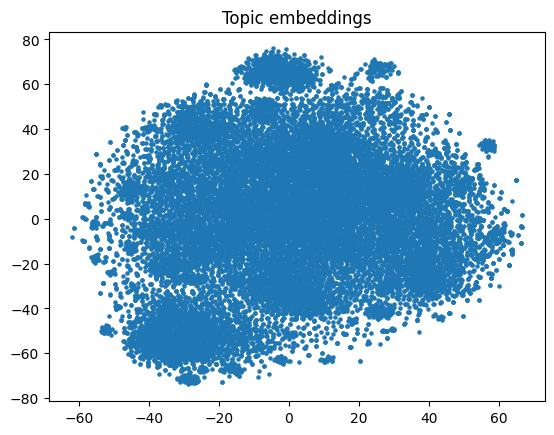
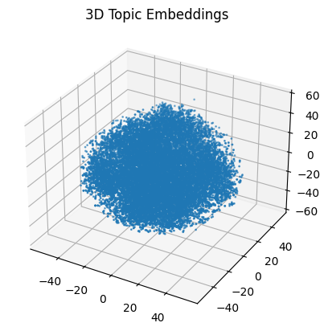
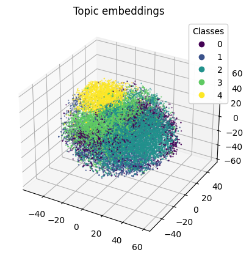

# Multilingual Textual Clustering with Multilingual-E5-Large-Instruct

This project presents a comprehensive solution for clustering multilingual text documents using the Multilingual-E5-Large-Instruct model, which is based on the XLM-RoBERTa architecture. It encompasses essential functions and strategies for acquiring, cleansing, and processing multilingual text data, facilitating the grouping of similar texts across different languages without the need for predefined labels.

## Features

- **Data Acquisition**: Implements a function to fetch and load customer complaint data from diverse sources, accommodating multiple languages.
- **Data Preprocessing**: Offers techniques for cleaning multilingual text data, which include normalization, tokenization, and the elimination of extraneous characters, making the texts ready for clustering.
- **Multilingual Text Clustering**: Leverages the power of Multilingual-E5-Large-Instruct embeddings to convert texts into high-dimensional vectors across languages, and employs clustering algorithms to categorize similar texts together.

## Overview

### Embeddings Prior to Clustering
Visual representations of the dataset embeddings before applying clustering algorithms.
- 
- 

### Embeddings Following Clustering with PCA-Enhanced K-means
Visual illustrations showing the distribution of multilingual text clusters after the application of PCA-enhanced K-means clustering.
- 
- 

This project demonstrates the applicability of advanced NLP techniques for understanding and organizing customer feedback in various languages, leveraging state-of-the-art multilingual embeddings for effective clustering.