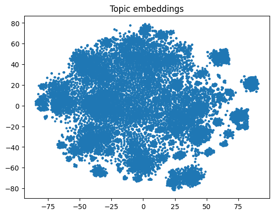
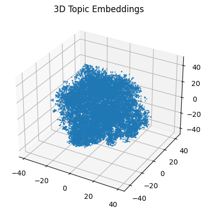
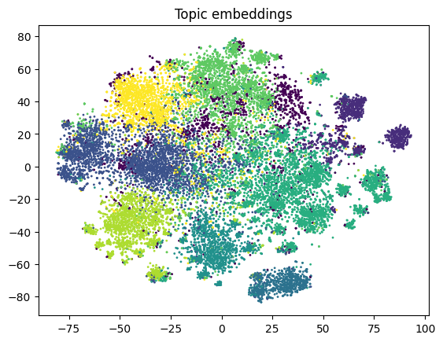
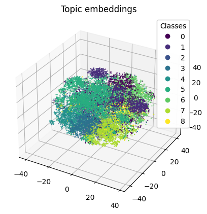

---

# Textual Clustering with BERT

This project implements a solution for clustering text documents using the BERT (Bidirectional Encoder Representations from Transformers) model. The notebook includes key functions and methodologies for retrieving, cleaning, and processing text data for the purpose of grouping similar texts together without predefined labels.

## Features

- **Data Retrieval**: Implements a function for fetching and loading text data from various sources.
- **Data Cleaning**: Provides methodologies for preprocessing text data, including normalization, tokenization, and removal of irrelevant characters, to prepare it for clustering.
- **Text Clustering**: Utilizes BERT embeddings to transform text into high-dimensional vectors and applies clustering algorithms to group similar texts.

## Overview

### Embeddings Before Clustering

### Embeddings After K-means with PCA

---